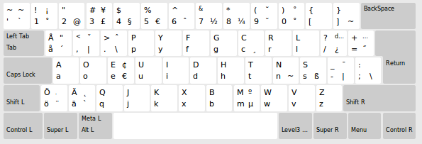

Swedish Dvorak for Linux
=========================



How to use it:
---------------

1. Drop the layout file as `/usr/share/X11/xkb/symbols/se_sv_dvorak`.

2. The layout can now be used by running `sudo setxkbmap se_sv_dvorak`.

Adding it to the menus (in Ubuntu/Kubuntu at least):
-------------------------------------------------------

If you want the layout added in the menus, insert the following in `/usr/share/X11/xkb/rules/evdev.xml`:

```xml
<layout>
    <configItem>
        <name>se_sv_dvorak</name>            
        <shortDescription>sv_dvorak</shortDescription>
        <description>Swedish Dvorak [Lundqvist et al.]</description>
        <languageList>
            <iso639Id>swe</iso639Id>
        </languageList>
    </configItem>
    <variantList>
        <configItem>
            <name>sv_dvorak</name>
            <description>Swedish Dvorak [Lundqvist et al.]</description>
        </configItem>
    </variantList>
</layout>
```

Want to contribute?
----------------------

You are most welcome. Just send a pull request!